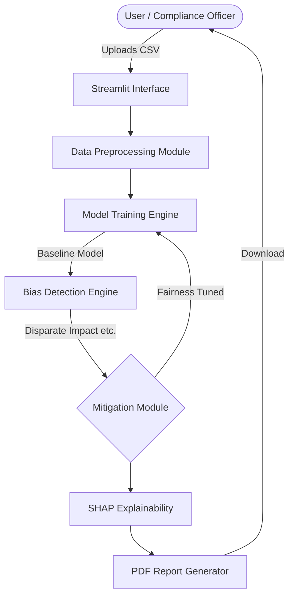
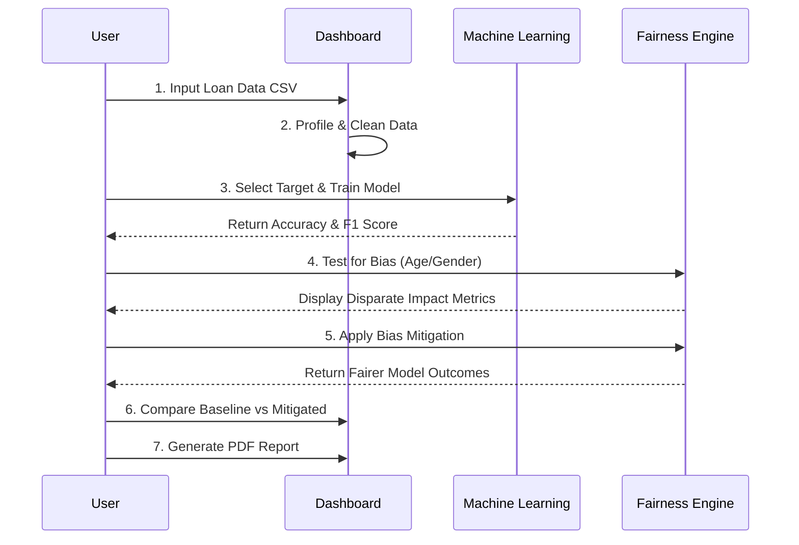

# LoanGuard: Fairness Audit & Bias Mitigation Pipeline

[](https://share.streamlit.io/)
[](https://opensource.org/licenses/MIT)

LoanGuard is a platform designed to audit, detect, and mitigate algorithmic bias in loan approval models. It provides a suite of tools to help ensure regulatory compliance (ECOA, GDPR, EU AI Act) and promote ethical lending practices.

---

## Architecture Diagram

The system follows a strict pipeline architecture, moving from raw data ingestion to audited PDF reporting.



---

## Application Workflow Diagram

The sequence below illustrates how a user interacts with the pipeline from start to finish.



---

## Sidebar Modules in Detail

The platform is navigated via the sidebar. Here is why and how you use each section:

1. **Overview**: The main dashboard providing a high-level summary of your pipeline status. Use this to check overall system readiness at a glance.
2. **Data Management**: The starting point where you upload your `loan_data.csv`. Use this section to preview columns, handle missing values, and check data completeness before doing any ML work.
3. **Model Training**: Where you define the target column (e.g., `loan_status`). You use this to establish a baseline model. It will split your data (80/20 train-test split) and output standard machine learning metrics like Accuracy, Precision, and Recall.
4. **Bias Analysis**: Once a model is trained, use this module to select demographic attributes (like `gender` or `age`). It calculates legal fairness metrics (like Demographic Parity) to tell you if the model overwhelmingly favors one group over another.
5. **Mitigation Engine**: If the Bias Analysis finds a problem, use this section. It applies fairness-aware retraining algorithms to equalize the approval rates across your sensitive groups.
6. **Performance Comparison**: Use this section to review the trade-off. Fixing bias often changes raw accuracy. This tab places your Baseline Model next to your Mitigated Model so you can make an informed business decision.
7. **Explainability**: This section generates SHAP (SHapley Additive exPlanations) values. Use it to understand *why* the model made specific decisions, highlighting which features (e.g., income, credit score) heavily influenced the outcome.
8. **Compliance Reports**: The final step. Use this to freeze your audit results into a downloadable PDF that can be handed to regulators or internal risk teams.

---

## Technology Stack and ML Models 

### Machine Learning Models Used
- **Random Forest Classifier (Recommended)**: 
  - **Why:** Selected for its superior predictive performance on tabular datasets. It handles non-linear relationships and interactions between loan features (like Income vs. Debt-to-Income ratio) more effectively than linear models.
  - **Utility:** It serves as the primary "high-fidelity" model for the audit.
- **Logistic Regression (Baseline)**: 
  - **Why:** Chosen for its transparency and simplicity. In highly regulated financial environments, Logistic Regression is often the "Gold Standard" because its coefficients are directly interpretable by human auditors.
  - **Utility:** Used as a reference point to compare how much complexity is actually needed for the task.

### Advanced Fairness & Explainability Stack
- **Fairlearn**: 
  - **Where:** Used for calculating fairness metrics (Demographic Parity, Equalized Odds) and performing model mitigation via the `ExponentiatedGradient` reduction algorithm.
- **AIF360 (AI Fairness 360)**: 
  - **Where:** Provides the **Reweighing** mitigation technique, which adjusts the importance of specific training samples to ensure demographic equity without changing the model architecture.
- **SHAP (SHapley Additive exPlanations)**: 
  - **Where:** Powers the "Explainability" module. It breaks down individual loan decisions to show exactly how much every feature (Age, Credit Score, etc.) contributed to a "Yes" or "No".

### Core Infrastructure
- **Frontend**: `Streamlit` - The framework powering the interactive dashboard and real-time visualization.
- **Engine**: `Python` - The core programming language managing all backend logic.
- **Data Architecture**: `Pandas` & `NumPy` - Used for data ingestion, cleaning, and complex feature engineering.
- **Visuals**: `Plotly` & `Matplotlib` - Used for generating high-definition, interactive charts and the SHAP summary plots.

---

## Quick Start

### Installation

1. **Clone the repository:**
   ```bash
   git clone https://github.com/Prakash-Ramakrishnan110/Loan-project.git
   cd Loan-project
   ```

2. **Set up a virtual environment:**
   ```bash
   python -m venv venv
   source venv/bin/activate  # On Windows: venv\Scripts\activate
   ```

3. **Install dependencies:**
   ```bash
   pip install -r requirements.txt
   ```

4. **Launch the application:**
   ```bash
   streamlit run app.py
   ```

---

## License

This project is licensed under the MIT License - see the [LICENSE](LICENSE) file for details.
