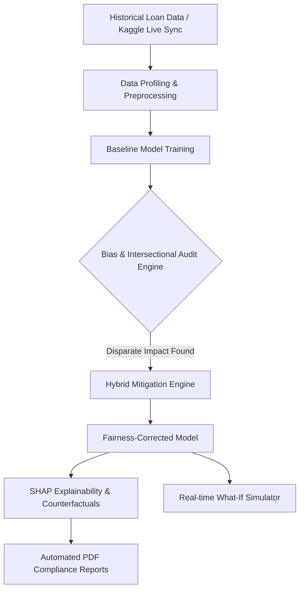
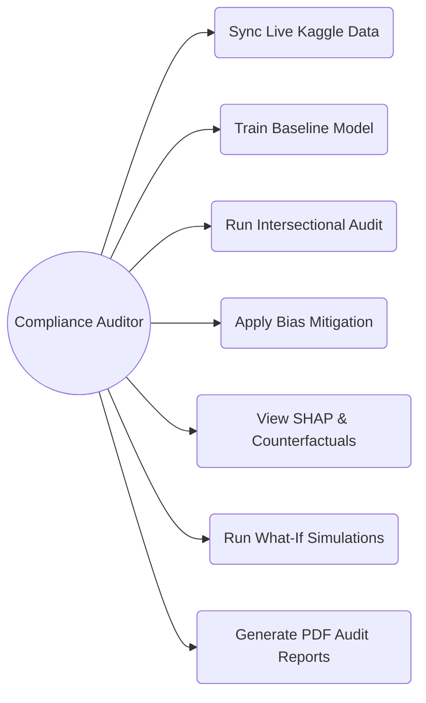

# Enterprise Fairness Audit Platform: Bias Mitigation Pipeline

## 1. Project PPT (Title Slide)
**Title:** Enterprise Fairness Audit Platform: Bias Mitigation Pipeline
**Subtitle:** An AI-driven system for fair, transparent, and compliant loan approvals.

---

## 2. Abstract
Artificial Intelligence is increasingly being adopted in financial decision systems, but standard models often reflect historical biases, leading to unfair loan rejections based on sensitive attributes like gender or age. This project proposes an **Enterprise Fairness Audit Platform**, a premium system designed to audit, detect, and mitigate algorithmic bias in loan approvals. It utilizes hybrid bias mitigation (reweighing and exponentiated gradient), advanced explainability (SHAP), intersectional auditing, and counterfactual generation to ensure fair outcomes while maintaining compliance with global regulations such as ECOA, GDPR, and the EU AI Act.

---

## 3. Problem Statement
Financial institutions use machine learning models for loan approval, but these models can inadvertently inherit demographic biases from historical training data. This leads to:
- Unfair treatment of minority or protected groups.
- Regulatory compliance failures.
- A lack of transparency in automated decision-making ("Black Box" models).
- Inability to detect hidden biases across overlapping demographic groups (Intersectional Bias).

---

## 4. Objectives
- To develop a predictive ML model for loan approvals with high accuracy.
- To audit and detect inherent bias using disparate impact, demographic parity metrics, and intersectional analysis.
- To mitigate bias using dual-layer logic (pre-processing and in-processing).
- To provide deep model transparency using SHAP and Counterfactual Explanations.
- To automatically generate enterprise-grade compliance dossiers.

---

## 5. Literature Survey
- **Algorithmic Bias in Finance:** Studies show standard models often penalize marginalized groups due to skewed historical data.
- **Fairness Metrics:** Research highlights the use of Disparate Impact and Equalized Odds to measure fairness mathematically.
- **Explainable AI (XAI) & Recourse:** Incorporating game-theory mechanisms (SHAP) and counterfactuals allows auditors to understand the "why" behind black-box ML predictions and provide actionable recourse to applicants.

---

## 6. Existing System
The existing systems rely on standard machine learning algorithms like Random Forest or Logistic Regression. They optimize strictly for predictive accuracy without evaluating demographic parity, meaning they do not explicitly check if decisions unfairly disadvantage certain demographic groups, especially across complex intersections (e.g., gender and age combined).

---

## 7. Existing System Disadvantages
- Inherits and amplifies historical data biases.
- Lacks transparency and explainability.
- Fails to comply with modern fairness regulations (ECOA, GDPR, EU AI Act).
- High risk of reputational and legal damage.
- Cannot sync with live real-world datasets effectively.

---

## 8. Proposed System
The proposed system integrates a rigorous fairness pipeline into the model training process. It leverages tools like `Fairlearn` and `AIF360` to perform multi-dimensional and intersectional bias auditing. It mitigates bias through Dual-Layer logic, offers a What-If simulator for stress-testing, provides granular explanations using SHAP, generates actionable counterfactuals, and supports live real-time Kaggle dataset synchronization for accurate profiling.

---

## 9. Proposed System Advantages
- **Intersectional Fairness:** Ensures demographic parity across multiple sensitive groups simultaneously.
- **Actionable Counterfactuals:** Tells rejected applicants exactly what they need to change to be approved.
- **Live Data Integration:** Seamless Kaggle integration for profiling massive real-world datasets.
- **Fairness-Accuracy Trade-off Analytics:** Precision visual frontiers mapping model accuracy against compliance.
- **Automated Compliance:** Delivers transparent explanations and automated PDF audit reports.

---

## 10. System Architecture

---

## 11. Techniques and Mechanism
- **Machine Learning Algorithms:** Random Forest, Logistic Regression.
- **Pre-processing Fairness:** Reweighing (balancing historical data bias before training).
- **In-processing Fairness:** Exponentiated Gradient (enforcing parity constraints during training).
- **Intersectional Bias Detection:** Multi-attribute disparity measurement.
- **Explainability:** SHAP (revealing feature impact) and Counterfactual Generation (actionable recourse).

---

## 12. Usecase Diagram

---

## 13. Modules

1. **Data Management Module:** Profiling, cleaning, and live Kaggle synchronization.
2. **Model Training Module:** Establishes baselines and measures predictive accuracy.
3. **Bias Analysis & Intersectional Audit Module:** Multi-dimensional disparity measurement and Regulatory Gauge mapping.
4. **Mitigation Engine:** Applies state-of-the-art fairness algorithms with Trade-off Analytics.
5. **Explainability & Counterfactual Module:** Provides SHAP decision transparency and actionable recourse generation.
6. **Real-time Simulator (What-If):** Live stress-testing sandbox.
7. **Compliance Reporting Module:** Generates the final audit dossier with rejection remarks.

---

## 14. Future Enhancement
- Live integration with banking APIs and credit bureaus.
- Role-based Authentication for different auditor clearance levels.
- Expanding fairness constraints to deep learning models.
- Multi-lingual support for global compliance reports.

---

## 15. Hardware and Software Requirements
- **Hardware:** Standard PC/Server with at least 8GB RAM and a modern multi-core processor.
- **Software:** 
  - Python 3.8+
  - UI: Streamlit, Plotly
  - ML & AI: Scikit-learn, Fairlearn, AIF360, SHAP, Kagglehub
  - Data: Pandas, NumPy
  - Reporting: fpdf2

---

## 16. Conclusion
The Enterprise Fairness Audit Platform successfully bridges the gap between predictive accuracy and ethical AI. By integrating robust intersectional bias mitigation, actionable counterfactuals, and deep explainability, it transforms the traditional black-box loan approval process into a transparent, compliant, and fair system, setting a new standard for modern financial decision-making.
