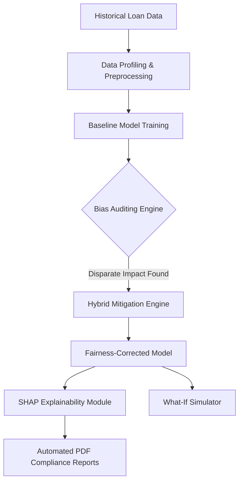
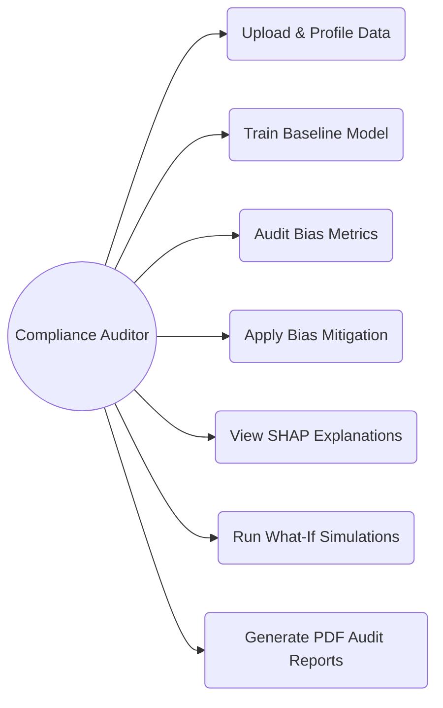

# LoanGuard AI: Enterprise Fairness Audit & Bias Mitigation Pipeline

## 1. Project PPT (Title Slide)
**Title:** LoanGuard AI: Enterprise Fairness Audit & Bias Mitigation Pipeline
**Subtitle:** An AI-driven system for fair, transparent, and compliant loan approvals.

---

## 2. Abstract
Artificial Intelligence is increasingly being adopted in financial decision systems, but standard models often reflect historical biases, leading to unfair loan rejections based on sensitive attributes like gender or age. This project proposes **LoanGuard AI**, a premium platform designed to audit, detect, and mitigate algorithmic bias in loan approvals. It utilizes hybrid bias mitigation (reweighing and exponentiated gradient) and advanced explainability (SHAP) to ensure fair outcomes while maintaining compliance with global regulations such as ECOA and GDPR.

---

## 3. Problem Statement
Financial institutions use machine learning models for loan approval, but these models can inadvertently inherit demographic biases from historical training data. This leads to:
- Unfair treatment of minority or protected groups.
- Regulatory compliance failures.
- A lack of transparency in automated decision-making ("Black Box" models).

---

## 4. Objectives
- To develop a predictive ML model for loan approvals with high accuracy.
- To audit and detect inherent bias using disparate impact and demographic parity metrics.
- To mitigate bias using dual-layer logic (pre-processing and in-processing).
- To provide deep model transparency using SHAP (Shapley Additive exPlanations).
- To automatically generate enterprise-grade compliance dossiers.

---

## 5. Literature Survey
- **Algorithmic Bias in Finance:** Studies show standard models often penalize marginalized groups due to skewed historical data.
- **Fairness Metrics:** Research highlights the use of Disparate Impact and Equalized Odds to measure fairness mathematically.
- **Explainable AI (XAI):** Incorporating game-theory mechanisms (SHAP) allows auditors to understand the "why" behind black-box ML predictions, increasing trust and compliance.

---

## 6. Existing System
The existing systems rely on standard machine learning algorithms like Random Forest or Logistic Regression. They optimize strictly for predictive accuracy without evaluating demographic parity, meaning they do not explicitly check if decisions unfairly disadvantage certain demographic groups.

---

## 7. Existing System Disadvantages
- Inherits and amplifies historical data biases.
- Lacks transparency and explainability.
- Fails to comply with modern fairness regulations (ECOA, GDPR, EU AI Act).
- High risk of reputational and legal damage.

---

## 8. Proposed System
The proposed system, **LoanGuard AI**, integrates a rigorous fairness pipeline into the model training process. It leverages tools like `Fairlearn` and `AIF360` to perform bias auditing, mitigates bias through Dual-Layer logic (Reweighing & Exponentiated Gradient), offers a What-If simulator for stress-testing, and provides granular explanations using SHAP.

---

## 9. Proposed System Advantages
- Ensures demographic parity and equity.
- Features an interactive compliance auditing sandbox.
- Delivers transparent explanations for every loan rejection.
- Automatically generates audit-ready PDF reports.
- Aligns with strict regulatory standards.

---

## 10. System Architecture

---

## 11. Techniques and Mechanism
- **Machine Learning Algorithms:** Random Forest, Logistic Regression.
- **Pre-processing Fairness:** Reweighing (balancing historical data bias before training).
- **In-processing Fairness:** Exponentiated Gradient (enforcing parity constraints during training).
- **Explainability:** SHAP (revealing feature impact and hidden proxy variables).

---

## 12. Usecase Diagram

---

## 13. Modules

1. **Data Management Module:** Profiling and cleaning of financial datasets.
2. **Model Training & Bias Analysis Module:** Establishes baselines and measures disparate impact.
3. **Mitigation Engine:** Applies state-of-the-art fairness algorithms.
4. **Explainability (SHAP) Module:** Provides individual and global decision transparency.
5. **Interactive Simulator (What-If):** Real-time stress testing of loan logic.
6. **Compliance Reporting Module:** Generates the final audit dossier with rejection remarks.
7. **Authentication & Role Management (Future):** Role-based access control for Compliance Officers vs. General Staff.

---

## 14. Future Enhancement
- Live integration with banking APIs and credit bureaus.
- Role-based Authentication for different auditor clearance levels.
- Expanding fairness constraints to deep learning models.
- Multi-lingual support for global compliance reports.

---

## 15. Hardware and Software Requirements
- **Hardware:** Standard PC/Server with at least 8GB RAM and a modern multi-core processor.
- **Software:** 
  - Python 3.8+
  - UI: Streamlit, Plotly
  - ML & AI: Scikit-learn, Fairlearn, AIF360, SHAP
  - Data: Pandas, NumPy
  - Reporting: fpdf2

---

## 16. Conclusion
LoanGuard AI successfully bridges the gap between predictive accuracy and ethical AI. By integrating robust bias mitigation techniques and deep explainability, it transforms the traditional black-box loan approval process into a transparent, compliant, and fair system, setting a new standard for modern financial decision-making.
